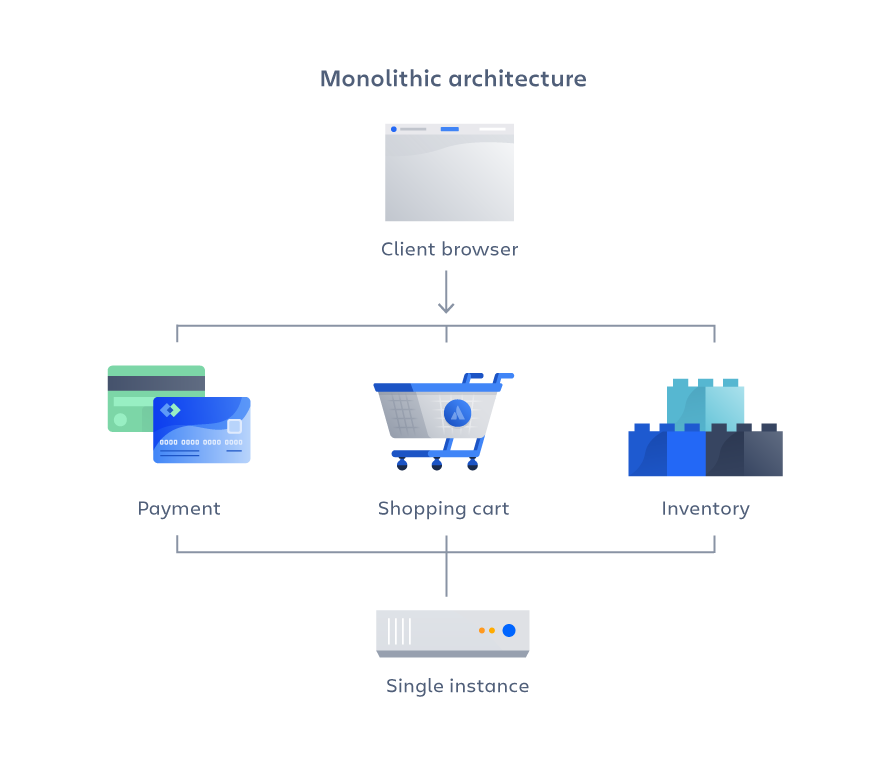
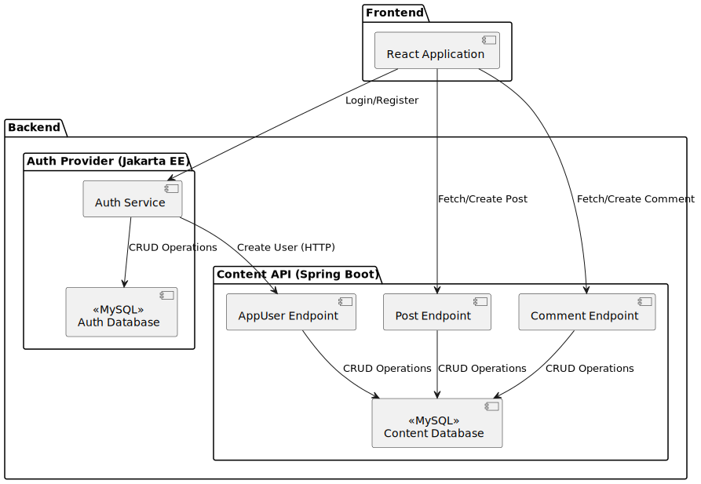

= Java Enterprise Application Dokumentation
:title-page:
Autoren: Dimitri Waber und Yannick Englert
1.0, June 15, 2024: Dozent: Daniel Senften
:toc:
:toc-title: Inhaltsverzeichnis
:toclevels: 5
:icons: font
:pdf-theme: themes/pdf-theme.yml
:title-logo-image: 

Die Dokumentation für die Modularbeit im Modul Java Enterprise Application (JEA) wird in AsciiDoc geschrieben. AsciiDoc ist ein Textdokumentationsformat für Schriftsteller und Entwickler, das sowohl einfach als auch leistungsstark ist. AsciiDoc erlaubt es mehr Zeit in die Dokumentation anstelle von Formatierung zu investieren.

Befehle zum Ausführen im Terminal werden in einem grauen Kasten und mit einem führenden `$` kennzeichnet. Dies ermöglicht es dem Leser die Befehle einfach zu kopieren und im Terminal auszuführen.

Beispiel:
[source,console]
----
$ echo "Hello World"
----

Befehle in einem grauen Kasten sind Befehle, die ein Script ausführt und als Erklärung oder Referenz für eine manuelle Ausführung dienen.

Beispiel:
[,bash]
----
docker push my-image
----

== Einleitung

In Java Enterprise Applications (JEA) werden schrittweise verschiedene Architekturstile für Applikationen angeschaut. Die Modularbeit dient dazu das erlernte in Java umzusetzen und die Vorteile sowie Nachteile der verschiedenen Architekturstile zu erkennen.

Am Ende des Moduls wird die Dokumentation sowie ein lauffähiges Programm abgegeben für den Leistungsnachweis.

*Auftrag*: _Die Modularbeit umfasst die schrittweise konzipierte und entwickelte Enterprise-Applikation. Dabei sind die Konzepte der jeweiligen Module im Lösungsentwurf und in der Umsetzung der zu realisierenden Applikation anzuwenden. Als Ergebnis liegen eine schriftliche Dokumentation und ein lauffähiges Programm vor. Die schriftliche Arbeit und das lauffähige Programm machen jeweils 50% der Modularbeits-Note aus. Die Modularbeit wird stets in der Nacharbeit zur PVA um das jeweilige Schwerpunktthema ergänzt. Dabei sind die verschiedenen Architekturstile zu reflektieren, die im Laufe des Moduls erlernt werden. Die Modularbeit erfolgt in Gruppen von zwei bis drei Student/innen._

=== Architekturstile

Folgende Architekturstile wurden im Modul angeschaut:

* Monolithische Architektur
* Schichten Architektur
* Web-Service Architektur
* Microservices Architektur

[caption="Bild {counter:figure}: "]
.Architekturenfootnote:[Quelle: Moodle JEA]

== Idee und Beschreibung der Modularbeit

Als Web Anwendung wurde ein Blog als Idee ausgewählt und entwickelt. Die Webanwendung soll die Möglichkeit bieten Beiträge zu lesen, Beiträge zu erstellen, zu bearbeiten und zu löschen. Dabei sollen die Benutzer auch authentifizierbar sein. Der Blog wird in den verschiedenen Architekturstilen umgesetzt. Gemäss Moodle Auftrag soll dabei mit Jakarta EE angefangen werden und dann schrittweise erweitert werden. Es ist jedoch nicht unüblich in der Praxis das bei einem Technologiewechsel (wie z.B. auf Container und Kubernetes) auch ein komplettes Refactoring der Applikation stattfindet.

Da in der Gruppe schon bestehendes Wissen zu Kubernetes, Cloud Native Applikationen und DevOps Prinzipien existiert wurde der Fokus in den Aufbau einer Microservices-Architektur auf Kubernetes gelegt. Dies inkludiert eine (CI)/CD Pipeline die es ermöglicht völlig automatisch die Anwendung innerhalb Kubernetes zu deployen und zu testen. Dies ist besonders wichtig da sich die fertige Lösung nicht in der Cloud befindet und somit jeweils lokal auf der Maschine getestet werden muss. Fertige Scripts ermöglichen es dem zu prüfenden Dozenten die Applikation zu bauen und auf Kubernetes zu deployen.

Obschon "weniger" Zeit in die anderen Architekturstile investiert wurde, wurden diese dennoch umgesetzt, dokumentiert und die jeweiligen Vor- und Nachteile aufgezeigt.

== Vor- und Nachteile der Architekturstile

In diesem Kapitel werden die Vor- und Nachteile der verschiedenen Architekturstile aufgezeigt und näher beleuchtet.

=== Monolithische Architektur

[caption="Bild {counter:figure}: "]
.Monolithische Architekturfootnote:[Quelle: https://www.atlassian.com/microservices/microservices-architecture/microservices-vs-monolith]

==== Vorteile:
- Einfachheit der Entwicklung und des Deployments:
* Ein einzelnes, zusammenhängendes Code-Repository.
* Einfachere Build- und Deployment-Prozesse, da nur ein Artefakt erstellt und bereitgestellt werden muss.

- Performance:
* Direkte Funktionsaufrufe innerhalb desselben Prozesses sind schneller als Netzwerkaufrufe zwischen Diensten.
* Keine Notwendigkeit für Netzwerkkommunikation, was Latenzzeiten reduziert.

- Konsistenz und Integration
* Alle Komponenten teilen denselben Speicher und dieselben Datenstrukturen, was die Konsistenz gewährleistet.
* Keine Notwendigkeit für komplexe Integrationsmechanismen oder API-Gateways.

- Infrastrukturkosten:
* Weniger komplexe Infrastruktur erforderlich, da keine Container-Orchestrierung oder Service-Meshes benötigt werden.
* Einfachere Skalierung durch vertikale Skalierung (Erhöhung der Ressourcen eines einzelnen Servers).

==== Nachteile:
- Skalierbarkeit:
* Schwieriger zu skalieren, da die gesamte Anwendung als eine Einheit skaliert werden muss.
* Vertikale Skalierung (Erhöhung der Ressourcen eines einzelnen Servers) hat physische Grenzen.

- Komplexität:
* Mit zunehmender Grösse und Komplexität der Anwendung wird der Code schwerer zu verstehen und zu warten.
* Änderungen in einem Teil der Anwendung können unbeabsichtigte Auswirkungen auf andere Teile haben.

- Eingeschränkte Flexibilität:
* Schwerer, neue Technologien oder Frameworks für einzelne Teile der Anwendung einzuführen.
* Alle Teile der Anwendung müssen dieselbe Technologie-Stack verwenden.

- Abhängigkeiten und Kopplung:
* Hohe Kopplung zwischen den Komponenten kann die Wartbarkeit und Erweiterbarkeit beeinträchtigen.
* Änderungen in einer Komponente können umfangreiche Tests und Anpassungen in anderen Komponenten erfordern.

=== Schichtenarchitektur

- Modularität:
* Jede Schicht hat eine klar definierte Rolle und Verantwortlichkeit.
* Erleichtert die Wartung und Erweiterung der Anwendung

- Wiederverwendbarkeit:
* Komponenten in einer Schicht können von mehreren anderen Schichten wiederverwendet werden.
* Reduziert den Entwicklungsaufwand und fördert die Konsistenz.

- Testbarkeit:
* Jede Schicht kann unabhängig von anderen Schichten getestet werden.
* Ermöglicht eine bessere Fehlerisolierung und Fehlerbehebung.

- Austauschbarkeit:
* Eine Schicht kann leicht durch eine andere ersetzt werden, solange die Schnittstelle erhalten bleibt.
* Ermöglicht eine bessere Skalierbarkeit und Flexibilität.

==== Nachteile

- Performance:
* Die Kommunikation zwischen den Schichten kann zu einer höheren Latenzzeit führen.
* Performance-Overhead.

- Komplexität:
* Die Implementierung und Wartung von mehreren Schichten kann komplexer sein als beispielsweise bei einer monolithischen Architektur.
* Erfordert ein gutes Verständnis der Schnittstellen und Kommunikation zwischen den Schichten.

- Skalierbarkeit:
* Jede Schicht muss möglicherweise skaliert werden, um den Anforderungen gerecht zu werden.
* Kann komplizierter sein als beispielsweise die Skalierung einzelner Microservices.

- Kopplung der Schichten
* Obwohl Schichten modular sind, können sie stark voneinander abhängig sein.
* Änderungen in einer Schicht können unerwartete Auswirkungen auf andere Schichten haben.

=== Microservices Architektur

[caption="Bild {counter:figure}: "]
.Microservices Architekturfootnote:[Quelle: https://www.atlassian.com/microservices/microservices-architecture/microservices-vs-monolith]

==== Vorteile

- Skalierbarkeit:
* Jeder Microservice kann unabhängig skaliert werden, um spezifischen Anforderungen gerecht zu werden.
* Ermöglicht eine effizientere Ressourcennutzung und Anpassung an Lastspitzen.

- Unabhängige Entwicklung und Deployment:
* Teams können an verschiedenen Microservices unabhängig voneinander arbeiten und diese bereitstellen.
* Erhöht die Entwicklungs- und Bereitstellungsgeschwindigkeit.

- Technologieunabhängigkeit:
* Jeder Microservice kann in einer anderen Programmiersprache oder mit unterschiedlichen Technologien implementiert werden.
* Erlaubt die Nutzung der besten Werkzeuge für spezifische Aufgaben.

- Fehlerisolierung:
* Bei einem Fehler in einem Microservice ist nur dieser betroffen und nicht die gesamte Anwendung.
* Erhöht die Zuverlässigkeit und Verfügbarkeit der Anwendung.

==== Nachteile

- Komplexität:
* Verwaltung und Orchestrierung vieler Microservices ist komplexer als bei monolithischen Anwendungen.
* Erfordert zusätzliche Tools und Infrastruktur wie Container-Orchestrierung (z.B. Kubernetes).

- Latenz und Overhead:
* Die Kommunikation zwischen den Microservices erfolgt über das Netzwerk, was zu Latenz.
* Höherer Overhead durch Netzwerkprotokolle und Datenserialisierung.

- Datenkonsistenz:
* Gewährleistung der Datenkonsistenz über mehrere verteilte Microservices hinweg ist herausfordernd.
* Erfordert komplexe Transaktions- und Synchronisationsmechanismen.

- Sicherheitsrisiken:
* Mehrere exponierte Endpunkte erhöhen die Angriffsfläche.
* Erfordert robuste Sicherheitsmassnahmen wie Authentifizierung, Autorisierung und Verschlüsselung für jeden Microservice.

== Lösungsentwurf

=== Monolithische Architektur

Als erstes wird die monolithische Architektur betrachtet. Bei dieser Architektur handelt es sich um eine klassische, traditionelle Architektur in der Softwareentwicklung. Hierbei wird die gesamte Applikation als ein grosses Ganzes betrachtet und besteht aus einer einzigen Codebase. Alle Funktionen und Services sind in einer einzigen Anwendung integriert und werden gemeinsam deployed. Dadurch ist die Applikation einfach zu entwickeln, testen und deployen. Jedoch kann die Komplexität der Applikation mit der Zeit zunehmen, was zu einer schlechteren Wartbarkeit und Skalierung führen kann. Zudem ist es schwieriger, neue Funktionen hinzuzufügen oder bestehende zu ändern, da dies Auswirkungen auf die gesamte Applikation haben kann.

Um die Blog-Applikation mit einer monolithischen Architektur umzusetzen, eignet sich beispielsweise Jakarta EE mit JSF (Java Server Faces) als Technologie. JSF bietet eine Komponenten-basierte Entwicklung von Web-Applikationen und ermöglicht eine klare Trennung von Präsentation und Logik. Für die Datenhaltung kann eine relationale Datenbank wie MySQL verwendet werden.

Eine weitere Möglichkeit ist die Verwendung von Spring Boot als Framework für die Implementierung der Blog-Applikation. Spring Boot bietet, im Vergleich zu Jakarta EE, eine einfachere Konfiguration und ermöglicht die schnelle Entwicklung von Web-APIs. Auch Spring Boot bietet die Möglichkeit eine monolithische Applikation zu entwickeln. Dafür kann eine Template-Engine wie Thymeleaf verwendet werden.

Dabei muss erwähnt werden, dass es sich bei beiden, zumindest intern, eigentlich bereits um eine Schichtenarchitektur handelt. Trotzdem werden die Applikationen als Monolith deployt. Zudem besteht eine starke Abhängigkeit zwischen den Schichten und den Klassen, da diese direkt miteinander kommunizieren.

=== Schichtenarchitektur

Die Schichtenarchitektur ist eine der bekanntesten Architekturformen. Sie besteht aus mehreren Schichten, die jeweils bestimmte Aufgaben erfüllen. Diese Schichten sind hierarchisch angeordnet und kommunizieren nur über definierte Schnittstellen miteinander. Dadurch wird eine lose Kopplung zwischen den Schichten erreicht, was die Wartbarkeit und Erweiterbarkeit der Applikation verbessert.

Wie bereits erwähnt sind Spring Boot und Jakarta EE bereits auf dieser Architektur aufgebaut. Somit kann beispielsweise das Frontend abgekoppelt werden und als eigene Schicht eine eigene Applikation darstellen, die über eine definierte Schnittstelle mit dem Backend kommuniziert. So können andere Technologien, wie beispielsweise React oder Angular, verwendet werden.

Besonders geeignet ist dafür eine REST-API, welche mit Spring REST oder Jax-RS umgesetzt werden kann. So können die einzelnen Komponenten der Applikation unabhängig voneinander entwickelt werden und sind nicht an eine spezifische Technologie gebunden. Zudem können die einzelnen Komponenten unabhängig voneinander skaliert werden, was eine bessere Skalierbarkeit der Applikation ermöglicht.

Zudem wird so auch ermöglicht verschiedene Frontends mit der Applikation zu verbinden. Beispielsweise eine Web-Applikation und eine Mobile App.

=== Microservices Architektur

In diesem Kapitel wird der Lösungsentwurf für die Microservices Architektur aufgezeigt. Dabei wird auf die einzelnen Microservices eingegangen und die Kommunikation zwischen den Microservices aufgezeigt. Ebenfalls wird aufgezeigt wie die Applikation gebaut und auf Kubernetes deployt wird.

==== Architektur
[caption="Bild {counter:figure}: "]
.Architektur der Applikation

Wie in Bild 4 zu sehen ist, besteht die Applikation aus eine Auth Provider Microservice, einem Frontend Microservice und einer REST-API für den Content. Die REST-API ist nach dem Schichtenmodell aufgebaut.
Es wurde also eine Mischung aus Microservices und Schichtenarchitektur verwendet. So können beide verwendet werden und für die Blog Applikation erschien dies als passend.

In einem weiteren Schritt könnte die Content-REST-API auch in Microservices aufgeteilt werden. Dies würde die Skalierbarkeit verbessern und eine bessere Trennung der Zuständigkeiten ermöglichen. Jedoch müsste eine Lösung gefunden werden, wie die Konsistenz der Daten sichergestellt werden kann. Ausserdem müssten bei mehreren Instanzen die Datenbanken synchronisiert werden, damit alle Benutzer alle Blogbeiträge und Kommentare sehen können.

Die Auth Provider Microservice ist für die Authentifizierung der Benutzer zuständig. Dazu wird eine Datenbank verwendet, um die Benutzerdaten zu speichern. Die Auth Provider REST-API ist für die Kommunikation zwischen dem Frontend und dem Auth Provider zuständig.
Der Vorteil eines eigenen Microservice für die Authentifizierung ist, dass dieser auch für andere Applikation verwendet werden könnte. Wobei dafür beim Authentication-Flow noch Anpassungen vorgenommen werden müssten.

Der Frontend Microservice ist für die Darstellung der Benutzeroberfläche zuständig. Dazu wird das Frontend Framework React verwendet, um die Benutzeroberfläche zu erstellen. Der Benutzer authentifiziert sich beim Auth Provider und erhält ein JWT-Token, welches auch bei der REST-API für den Content gültig ist.

Der Vorteil des Microservices für das Frontend ist, dass die Benutzeroberfläche unabhängig vom Backend entwickelt werden kann. Es können auch mehrere Frontends auf dieselbe REST-API zugreifen, was die Möglichkeit bietet, die Applikation um beispielsweise eine Mobile App zu erweitern.

Beim Erstellen eines Benutzers wird in der Datenbank des Auth Providers ein neuer Datensatz angelegt. Zusätzlich erstellt der Auth Provider in der Content-REST-API einen AppUser, der verwendet wird, um Relationen mit den Posts und Comments zu ermöglichen. Der AppUser könnte in einem weiteren Schritt ber vollständig vom Auth Provider übernommen werden.

===== Content-REST-API

Die Content-REST-API stellt die Daten für das Frontend bereit. Sie ist in Java mit dem Framework Spring Boot entwickelt und verwendet eine MySQL-Datenbank als Datenspeicher. Die API stellt folgende Endpunkte bereit:

*Posts*

* GET: /posts
* GET: /posts/{id}
* POST: /posts/{id}
* DELETE: /posts/{id}
* PUT: /posts/{id}

*Comments*

* GET: /comments
* GET: /comments/{id}
* POST: /comments/{id}
* DELETE: /comments/{id}
* PUT: /comments/{id}

*AppUser*

* POST: /users

[caption="Bild {counter:figure}: "]
.Klassendiagramm der Content-REST-API

====== Datenbank

Die Datenbank ist auf MySQL ausgelegt und wird von der Applikation automatisch angelegt, wenn sie nicht existiert.

[caption="Bild {counter:figure}: "]
.ERD der Content-REST-API

===== Auth Provider

Der Auth Provider ist ein Service, der die Authentifizierung und Autorisierung von Benutzern übernimmt. Er ist als Microservice ausgelegt und kann somit unabhängig von der Applikation betrieben werden.

[caption="Bild {counter:figure}: "]
.Klassendiagramm des Auth Providers

====== Datenbank

Die Datenbank ist auf MySQL ausgelegt und wird von der Applikation automatisch angelegt, wenn sie nicht existiert.

[caption="Bild {counter:figure}: "]
.ERD des Auth Providers

===== Frontend

Das Frontend ist eine React-Applikation, die mit Javascript geschrieben ist. Die Applikation nutzt den Auth Provider für die Authentifizierung und die Content-REST-API um die Daten zu verwalten. Die Applikation ist in der Lage, die Daten aus der API anzuzeigen und zu bearbeiten.

[caption="Bild {counter:figure}: "]
.Komponenten diagramm Frontend

=== Setup

Das Setup der Applikation ist für die lokale Entwicklung und für den Betrieb auf Kubernetes Cluster ausgelegt.

[caption="Bild {counter:figure}: "]
.Aufbau der Applikation auf K8Sfootnote:[Quelle: Eigene Darstellung (mit draw.io)]

*Voraussetzungen*

* Docker
* Kubernetes
* OpenJDK 17 (oder ähnlich - wird nur fürs Erstellen der Applikation benötigt)

Es *muss* eine funktionierende Kubernetes Umgebung vorhanden sein. Dies kann lokal mit Minikube, Talos oder Rancher Desktop sein. Eine Kubernetes Installation auf einem Cloud-Provider wie Google Cloud, AWS oder Azure sollte ebenfalls funktionieren, wurde jedoch nicht getestet.

*Das Setup wurde erfolgreich mit Rancher Desktop (K8S v1.29.4) auf MacOSX (14.5 mit Apple Silicon) getestet.*

NOTE: Gewisse Kubernetes Installationen können je nach Einstellungen und Setup Probleme mit DNS und Netzwerkverbindungen haben.

*Ordnerstruktur*

AsciiDoc Dokumentation:
----
asciidoc
├── images
└── themes
----

Microservice:
----
microservice
├── argocd (ArgoCD Templates)
├── dev (Dockerfiles und Image Scripts)
└── ops (Kubernetes Manifests)
----

Auth Applikation:
----
auth/
├── gradle
│   └── wrapper
└── src
    └── main
        ├── java
        │   └── ch
        │       └── ffhs
        │           └── jea
        │               └── auth
        └── resources
            └── META-INF
----

Blog Frontend:
----
blog-frontend
├── components
├── lib
│   ├── api
│   └── hooks
├── pages
│   └── posts
│       └── [postId]
├── public
└── styles
----

Blog Backend:
----
blog-rest
├── gradle
│   └── wrapper
└── src
    ├── main
    │   ├── java
    │   │   └── ch
    │   │       └── ffhs
    │   │           └── blogrest
    │   │               ├── appuser
    │   │               ├── comment
    │   │               ├── post
    │   │               └── security
    │   └── resources
    └── test
        └── java
            └── ch
                └── ffhs
                    └── blogrest
----

==== Installation der benötigten Tools

IMPORTANT: Die Applikation wurde auf MacOSX entwickelt und getestet. Die Installation der Tools sowie weitere Automatisierungen ist nicht unter Windows und Linux unterstützt.

Im Ordner `microservice` befindet sich ein `Makefile` welches für die weiteren Schritte benötigt wird. Das Makefile installiert nicht nur die benötigten Tools, sondern baut auch die Container Images und deployt die Applikation auf Kubernetes.

`make` muss auf MacOSX installiert sein und wird normalerweise mit XCode installiert.

CAUTION: Ohne `make` kann die Automatisierung nicht verwendet werden. Der Befehl `which make` muss eine erfolgreiche Rückmeldung im Terminal geben.

Der Befehl `make install-tools` installiert `brew` (Package Manager für MacOSX) und (mithilfe von `brew`) folgende Tools:

* `kubectl` - Kubernetes CLI
* `kustomize` - Template Engine für Kubernetes
* `vendir` - Dependency Manager
* `argocd` - Continuous Deployment Tool für Kubernetes
* `helm` - Package Manager für Kubernetes

Weiter wird `make install-tools` auch `brew update` und `brew cleanup` ausführen um sicherzustellen, dass die Tools auf dem neusten Stand sind. Wird dies nicht erwünscht empfiehlt sich die Installation der Tools manuell mit `brew install ...` durchzuführen.

*Installation Tools*

[source,console]
----
$ cd microservice
$ make install-tools
----

*Überprüfung der Tool-Umgebung*

[source,console]
----
$ make check-env
----

Ist der Befehl `make check-env` erfolgreich erfolgt diese Ausgabe: `[check-env] successfully`. Ist dies der Fall sind alle benötigten Tools für die nächsten Schritte installiert und es kann fortgefahren werden.

*In a nutshell*

In den nachfolgenden Kapiteln wird näher darauf eingegangen wie die Applikation gebaut wird, welche Konfigurationen getätigt werden können und wie sie auf Kubernetes deployt werden kann. An dieser Stelle werden kurz alle automatisierten `make` Befehle aufgelistet und erläutert:

[source,console]
----
$ make install
$ make build
$ make push
$ make deploy
$ make argocd-deploy
$ make sync
$ make install-tools
$ make port-forward-frontend
$ make argocd-login
----

* `make sync` - Synct die ArgoCD Templates
* `make install-tools` - Installiert alle benötigten Tools
* `make check-env` - Überprüft ob alle Tools installiert sind
* `make install` - Installiert ArgoCD
* `make build` - Baut alle Container Images
* `make push` - Pusht alle Container Images auf Docker Hub (gemäss Config)
* `make deploy` - Deployt alle Container Images auf Kubernetes mit kubectl
* `make argocd-deploy` - Deployt alle Container Images auf Kubernetes mithilfe von ArgoCD
* `make port-forward-frontend` - Port-Forwarding auf die Applikation
* `make argocd-login` - Port-Forwarding auf ArgoCD

Es ist nicht notwendig die folgenden Kapitel durchzuarbeiten. Die `make` Befehle sind ausreichend um die Applikation auf Kubernetes zu deployen.

Benötigte Befehle ohne ArgoCD installation:

[source,console]
----
$ make install-tools
$ make check-env
$ make deploy
# 2-5 Minuten warten
$ make port-forward-frontend
----

Benötigte Befehle mit ArgoCD installation:

[source,console]
----
$ make install-tools
$ make check-env
$ make sync
$ make install
# 2-5 Minuten warten
$ make port-forward-frontend
----

*Nach der Installation kann es einige Minuten dauern bis alles hochgefahren ist.*

==== Bauen der Container Images

NOTE: Dieses Kapitel kann übersprungen werden, wenn die vorbereiteten Docker Images von Docker Hub verwendet werden.

Für die Applikation können die Docker Images selber gebaut werden. Dazu wird das Makefile verwendet welches automatisierte Scripts ausführt welche die Container Images lokal baut.

*Vorbereitung*

Es wird ein Docker Hub Account benötigt. Dieser kann unter https://hub.docker.com/ erstellt werden.

Damit die Docker Images auf Docker Hub gepusht werden können, muss ein Account und ein passendes Repository existieren. Dies muss dann in der `dockerhub.config` gesetzt werden damit das Script die Images mit einem korrekten Tag versieht. Diese Datei liegt im jeweiligen Projektordner (unter `dev`) und hat folgenden Inhalt:

[source]
----
docker_account: USERNAME
docker_repository: REPONAME
----

*Build*

[source,console]
----
$ cd microservice
$ make build
----

*Erklärung*

Für jedes Image werden verschiedene Befehle ausgeführt. Diese sind einsehbar in den `build.sh` Scripts im jeweiligen Projektordner (unter `dev`).

Ein Beispiel für das Bauen eines nativen Images für Quarkus:

[,bash]
----
./gradlew build -Dquarkus.package.type=native -Dquarkus.native.enabled=true -Dquarkus.native.container-build=true -Dquarkus.native.container-runtime=docker
----

Danach wird mithilfe des erstellten Dockerfile das Docker Image gebaut:
[,bash]
----
docker build -f src/main/docker/Dockerfile.native -t "${DOCKER_USER}"/"${DOCKER_REPO}" . --platform linux/arm64
----

Die Platform wurde spezifisch für MacOSX mit Apple Silicon (ARM) gesetzt. Für andere Plattformen muss die Platform angepasst werden und der Befehl manuell ausgeführt werden.

==== Push der Container Images

NOTE: Dieses Kapitel kann übersprungen werden wenn die vorbereiteten Docker Images von Docker Hub verwendet werden.

Falls für die Applikation eigene lokale Docker Images gebaut wurden können diese nun mit automatisierten Scripts auf Docker Hub gepusht werden.

*Vorbereitung*

Es wird ein Docker Hub Account benötigt. Dieser kann unter https://hub.docker.com/ erstellt werden.

Damit die Docker Images auf Docker Hub gepusht werden können, muss ein Account und ein passendes Repository existieren. Dies muss dann in der `dockerhub.config` gesetzt werden damit das Script den Images mit einem korrekten Tag versieht. Diese Datei liegt im jeweiligen Projektordner (unter `dev`) und hat folgenden Inhalt:

[,bash]
----
docker_account: USERNAME
docker_repository: REPONAME
----

*Push*

[source,console]
----
$ cd microservice
$ make push
----

*Erklärung*

Für das Pushen des Docker Images wird `docker push` mit den Variablen aus der `dockerhub.config` ausgeführt:

[,bash]
----
docker push "${DOCKER_USER}"/"${DOCKER_REPO}"
----

==== Deploy der Applikation

Die Applikation kann mit oder ohne ArgoCD auf Kubernetes deployt werden. Eine Empfehlung ist es mithilfe von CI/CD Tools Applikationen zu bauen, testen, deployen und regelmässig nach GitOps Prinzipien Applikationen auf Kubernetes zu deployen. Die automatisierungen in den vorherigen Kapiteln können auch in eine CI Pipeline (wie z.B. Gitlab CI) ausgelagert werden, wurden aber aus praktischen Gründen nicht in dieser Modularbeit umgesetzt. Nachfolgend werden kurz GitOps und ArgoCD erläutert.

*GitOps* ist ein Betriebsmodell für z.B. Cloud-Native Applikationen welches auf den Prinzipien von Version Control und Continuous Deployment basiert. Die Applikationen werden in einem Git Repository gespeichert und mithilfe von CI/CD Tools automatisiert (meistens auf Kubernetes) deployt. Dabei wird das Repository als Single Source of Truth für die Applikation verwendet. Somit sollen manuelle Änderungen verhindern werden. Dies bedeutet jedoch auch das wenn GitOps enforced wird jegliche Änderungen ausschliesslich über das Git Repository gemacht werden müssen, selbst bei Notfällen oder Problemen.

*ArgoCD* ist ein Continuous Deployment Tool für Kubernetes, welches es ermöglicht die Applikation automatisiert, auf Kubernetes zu deployen. ArgoCD verwendet dabei die GitOps Prinzipien und kann Tools wie `kustomize` oder `helm` verwenden um die Applikation auf Kubernetes zu deployen. ArgoCD kann über eine `argocd` CLI oder über das Webinterface bedient werden. ArgoCD ermöglicht Rollbacks, Rollouts sowie Self Healing Mechanismen für die Applikation.

===== mit ArgoCD

NOTE: Falls ein ArgoCD schon installiert ist, kann direkt zum *Deploy der Applikation* Teil gesprungen werden.

Mithilfe von ArgoCD kann die Applikation relativ einfach deployt werden. Dafür wird aber initial eine ArgoCD Installation benötigt. Diese kann mithilfe des Makefiles installiert werden.

*Vorbereitung*

Unter `argocd/values.yml` befinden sich die Werte für die ArgoCD Installation. Diese werden für das Helm Template verwendet und hat folgende Werte:

[,yml]
----
namespace: argocd
admin_password: Test1234

redis-ha:
  enabled: false

controller:
  replicas: 1

server:
  replicas: 1

repoServer:
  replicas: 1

applicationSet:
  replicas: 1
----

Die Standardwerte sind für eine Testinstallation ausreichen und es wird nicht empfohlen diese zu ändern.

NOTE: Diese Testinstallation sollte auf KEINEN Fall für eine produktive Umgebung verwendet werden.

Mithilfe von `vendir` werden die Helm Charts in den `vendor` Ordner kopiert. Dies ist notwendig damit die Charts lokal verwendet werden können und die Version der Helm Charts in Git festgehalten werden. Das `vendir.yml` hat folgende Struktur:

[,yml]
----
---
apiVersion: vendir.k14s.io/v1alpha1
kind: Config
directories:
  - path: vendor
    contents:
      - path: argocd/argocd
        helmChart:
          name: argo-cd
          version: "7.1.0"
          repository:
            url: https://argoproj.github.io/argo-helm
----

Die Version von ArgoCD kann unter `directories.contents.helmChart.version` angepasst werden wenn benötigt. Damit die Templates lokal heruntergeladen werden muss `vendir sync` ausgeführt werden:

[source,console]
----
$ cd microservice
$ make sync
----

Ein erfolgreicher `vendir sync` wird mit der Ausgabe `Suceeded` quittiert.

*Installation ArgoCD*

CAUTION: Unbedingt sicherstellen, dass der korrekte Kubernetes Kontext gesetzt ist.

[source,console]
----
$ cd microservice
$ make install-argocd
----

*Erklärung*

Das Makefile führt ein Installations Script aus welches prüft ob ArgoCD bereits installiert ist. Ist dies der Fall wird eine Fehlermeldung ausgegeben und das Script beendet. Ist ArgoCD noch nicht installiert wird ArgoCD mithilfe von Helm und den Werten in `argocd/values.yml` auf den aktuellen Kontext Kubernetes Cluster deployt.

[,bash]
----
kubectl -n "$NAMESPACE" get deployment argocd-server &>/dev/null && { echo "ArgoCD already deployed" ; exit 1 ;}
kubectl create namespace "$NAMESPACE" || echo "Error creating namespace..."
kubectl get namespace "$NAMESPACE" &>/dev/null || { echo "Error checking namespace..."; exit 1;  }

helm install --values argocd/values.yml argocd vendor/argocd/argocd --namespace "$NAMESPACE"
----

Weiter führt `make install-argocd` einen Passwort Wechsel durch und setzt das Admin-Passwort auf `admin_password` aus `argocd/values.yml`. Dies soll verhindern dass das Initial Admin Passwort verwendet wird welches nach einem erfolgreichen Login invalid wird (wenn nicht geändert).

Das Script führt ein Port-Forwarding aus um ArgoCD über `localhost:8082` erreichen zu können. Dabei wird das Port-Forwarding im Hintergrund gestartet damit das Terminal weiterhin verwendet werden kann.

NOTE: Das Port-Forwarding muss manuell beendet werden. Mithilfe von `pkill kubectl port-forward` kann der Prozess beendet werden.

*ArgoCD Login*

NOTE: Der Username ist `admin` und das Admin Passwort ist in `argocd/values.yml` gesetzt.

Falls das Port-Forwarding beendet worden ist kann mithilfe von `make argocd-login` ein erneutes Port-Forwarding gestartet werden. Damit kann über `localhost:8082` auf das ArgoCD Webinterface zugegriffen werden (mit dem Admin Passwort aus `argocd/values.yml`). Weiter führt das Script ein Login mit der `argocd cli` durch damit ArgoCD ebenfalls mit der CLI verwendet werden könnte.

*Deploy der Applikation*

Nachdem ArgoCD installiert ist kann die Applikation mithilfe von ArgoCD deployt werden. Dabei werden mithilfe des Makefiles die Applikationsdefinitionen, das Applikationsprojekt sowie ein Gitlab Secret geladen (unter ops/argocd/):

[source,console]
----
$ cd microservice
$ make argocd-deploy
----

Dabei wird auch der Namespace "jea" erstellt in welchem alle Applikationen deployt werden.

Nachdem die Applikationsdefinitionen geladen wurden wird ArgoCD die Applikationen selbständig deployen. Dies kann einige Minuten dauern.

NOTE: Die Applikationen können ab nun auch über das ArgoCD Webinterface überwacht werden.

[caption="Bild {counter:figure}: "]
.ArgoCD Übersichtfootnote:[Quelle: Eigene Darstellung]

[caption="Bild {counter:figure}: "]
.ArgoCD Applikationsübersichtfootnote:[Quelle: Eigene Darstellung]

Auszug aus einer Applikationsdefinition:

[,yml]
----
  source:
    repoURL: https://git.ffhs.ch/yannick.englert/javaenterpriseapplications.git
    targetRevision: HEAD
    path: microservice/ops/auth
----

Gemäss dem GitOps Prinzip wird die Applikation aus dem Git Repository geladen und auf Kubernetes deployt. Änderungen müssen somit direkt im Git Repository gemacht werden damit ArgoCD die Änderungen übernehmen kann.

Alle Kubernetes Manifests die ArgoCD anwendet sind unter `ops/<project>` zu finden.

*Verwendung eines anderen Images*

Sollte ein anderes Image verwendet werden als die vorbereiteten kann das Image in den jeweiligen Kubernetes Manifests angepasst werden (z.B. `ops/auth/auth-deployment.yaml`).

CAUTION: Die Änderung am Kubernetes Manifest MUSS ins Git Repo eingecheckt werden damit ArgoCD die Änderungen übernehmen kann.

===== ohne ArgoCD

Mithilfe von `make deploy` werden alle Kubernetes Manifests unter `ops`auf Kubernetes deployt.

[source,console]
----
$ cd microservice
$ make deploy
----

*Erklärung*

Das Makefile führt ein `kubectl apply -f` auf alle Kubernetes Manifests (`ops/<project>) aus und deployt somit alle Ressourcen auf Kubernetes.

==== Testen der Applikation

Nachdem die Applikation auf Kubernetes deployt wurde kann die Applikation getestet werden. Dazu wird mithilfe von `make port-forward-frontend` ein Port-Forwarding auf das Frontend gestartet.

Unter `localhost:3000` kann der Blog erreicht werden und die Funktionalitäten getestet werden.

NOTE: Das Port-Forwarding muss manuell beendet werden. Mithilfe von `pkill kubectl port-forward` kann der Prozess beendet werden.

==== Aufräumen der Applikation

Nach dem Testen und Deployen muss die Applikation unter Umständen auch wieder abgebaut werden. Dazu stehen wieder einige `make` Befehle zur Verfügung die nachfolgend aufgezeigt werden.

===== mit ArgoCD deployed

Mithilfe von `make argocd-delete` kann die Applikation wieder abgebaut werden. Dabei werden alle Applikationen und Ressourcen auf Kubernetes durch ArgoCD gelöscht. Sobald alle Ressourcen gelöscht wurden kann ArgoCD ebenfalls mit `make delete` deinstalliert werden.

[source,console]
----
$ cd microservice
$ make argocd-delete
$ make uninstall
$ make delete
----

Danach muss nur noch der Namespace `jea` gelöscht werden:
[source,console]
----
$ kubectl delete namespace jea
----

===== ohne ArgoCD deployed

Mithilfe von `make uninstall` können alle Ressourcen auf Kubernetes gelöscht werden.

[source,console]
----
$ cd microservice
$ make uninstall
----

Danach muss nur noch der Namespace `jea` gelöscht werden:
[source,console]
----
$ kubectl delete namespace jea
----

==== Entfernen der Tools

Falls gewünscht können alle oder ausgewählte Tools deinstalliert werden. Dazu kann `brew uninstall` verwendet werden. Dies ist jedoch komplet optional und muss nicht zwingend durchgeführt werden.

Damit die Deinstallation einfach durchgeführt werden kann sind alle `brew uninstall` aufgelistet:

[source,console]
----
$ brew uninstall kubectl
$ brew uninstall kustomize
$ brew uninstall vendir
$ brew uninstall argocd
$ brew uninstall helm
----

== Fazit

Die Auseinandersetzung mit den verschiedenen Architekturen war grundsätzlich sehr interessant. Es hat gezeigt, dass es nicht die eine Architektur gibt, die für alle Fälle passt. Die Wahl einer gemischten Architektur war für uns die beste Wahl, da wir viele Vorteile aus beiden Architekturen nutzen konnten.

Im Fall des Blogs war die Verwendung der Schichtenarchitektur mit Spring vor allem für die Relationen zwischen den Entitäten sehr hilfreich. Bei einer Microservices-Architektur wäre dies komplexer gewesen und hätte mit sich geführt, dass die Relationen zwischen den Entitäten über verschiedene Services hinweg aufgelöst werden müssten. Es wäre aber durchaus möglich, die Entitäten zu entkoppeln und über REST-Schnittstellen zu kommunizieren, was wiederum die Vorteile der Microservices-Architektur genutzt hätte.

Was bei mehreren Instanzen der Services jedoch zu Problemen geführt hätte, ist die Datenbank. Bei einer Microservices-Architektur wäre es notwendig gewesen, für jeden Service eine eigene Datenbank zu haben. Dies hätte jedoch zu einer erhöhten Komplexität bei der Datenhaltung und -verwaltung geführt. Es wäre eine Synchronisation zwischen den verschiedenen Instanzen notwendig geworden, da immer alle Posts und Comments mit den jeweiligen Autoren geladen werden sollen.

Die abtrennung der Authentifizierung in einen Microservice hat den Vorteil, dass dieser unabhängig von den anderen Services entwickelt und skaliert werden kann. Zudem können Änderungen an der Authentifizierung ohne Auswirkungen auf die anderen Services durchgeführt werden. Da aber für den Content eine Schichtenarchitektur verwendet wurde und die Relation zum Autor aufgelöst werden sollte entstand eine gewisse Redundanz, da die Benutzer immer im Auth Provider und in der REST-API gespeichert werden mussten. Dafür ergibt sich der Vorteil, dass der Benutzer beispielsweise unabhängige Usernames wählen kann und nicht an einen globalen Benutzer gebunden ist.

Die Einblicke in das Deployment mit Container und Kubernetes und die Auseinandersetzung mit den Vor- und Nachteilen der verschiedenen Architekturen war sehr spannend und lehrreich. Die Arbeit fühlte sich aber auch etwas künstlich an, da in der Realität selten eine Applikation in allen möglichen Architekturen implementiert werden muss.

Ebenfalls benötigten die verschiedenen Applikationen extrem viel Zeitaufwand diese auf Kubernetes zu deployen. Da jeder Technologiestack eigene Anforderungen hat für das bauen eines Container Images musste relativ viel Zeit in jede einzelne Applikation investiert werden welche in einer homogeneren Umgebung nicht notwendig gewesen wäre. Es zeigte sich auch das Technologien wie Spring oder Quarkus sehr viel schneller und einfacher zu deployen auf Kubernetes sind als beispielsweise eine Jakarta Applikation.

Das Modul hat durch die vielen verschiedenen Architekturstile und Technologien einen guten - aber auch sehr aufwendigen Blick in die Welt der Enterprise Applikationen gegeben. Die Arbeit hat sich im Umfang natürlich auch vergrössert mit dem Einbau einer automatisierung (CI) und einer Deploymentlösung (CD) mit ArgoCD auf Kubernetes.

== Eigenständigkeitserklärung

_Übernommen von Moodle._

Mit der Abgabe dieser Arbeit bestätige ich,

* dass ich die vorliegende Arbeit selbstständig verfasst habe,
* dass alle sinngemäss und wörtlich übernommenen Textstellen aus fremden Quellen kenntlich gemacht wurden,
* dass alle mit Hilfsmitteln erbrachten Teile der Arbeit präzise deklariert wurden,
* dass keine anderen als die im Hilfsmittelverzeichnis aufgeführten Hilfsmittel verwendet wurden,
* dass das Thema, die Arbeit oder Teile davon nicht bereits Gegenstand eines Leistungsnachweises eines anderen Moduls waren, sofern dies nicht ausdrücklich mit der Referentin oder dem Referenten im Voraus vereinbart wurde,
* dass ich mir bewusst bin, dass meine Arbeit elektronisch auf Plagiate und auf Drittautorschaft menschlichen oder technischen Ursprungs überprüft werden kann und ich hiermit der FFHS das Nutzungsrecht so weit einräume, wie es für diese Verwaltungshandlungen notwendig ist.

== Hilfsmittelverzeichnis

_Übernommen von Moodle._

Alle angewandten Hilfsmittel sind zwingend zu deklarieren, wie beispielsweise privates Lektorat, bezahltes Lektorat, DeepL/Google-Translate-Übersetzungen, Generative AI, usw. Das Hilfsmittelverzeichnis ist auch in dem Fall beizufügen, wenn keine Hilfsmittel verwendet wurden.

Hilfsmittelverzeichnis
|===
|Welches Hilfsmittel wurde eingesetzt? |Wozu wurde das Hilfsmittel eingesetzt? |Betroffene Stellen

|GitHub CoPilot |Automatische mithilfe bei der Erstellung von Code in IntelliJ |Java-, AsciiDoc-Code
|GitHub CoPilot |Unterstützung bei der Erstellung von Tests in IntelliJ |Java-Code
|GitHub CoPilot |Automatische mithilfe bei der generierung von Text in IntelliJ |AsciiDoc-Text
|GitHub CoPilot Chat |Unterstützung bei der Konfiguration |Files
|IntelliJ/WebStorm  Korrektur| Automatische Korrektur von Rechtschreibfehlern | AsciiDoc-Text
|CodeGTP Plugin| Automatische Korrektur von Rechtschreibfehlern und automatische mithilfe bei der generierung von Text in IntelliJ/WebStorm | AsciiDoc-Text
|IntelliJ/WebStorm AI Code Completion| Automatische mithilfe bei der Erstellung von Code in IntelliJ/WebStorm | Java-, JavaScript-Code
|===

== Anhang
Das Projekt und die AsciiDoc Dokumentation sind auf GitHub verfügbar: https://github.com/rumpli/FFHS-JEA.git[GitHub Repository]

